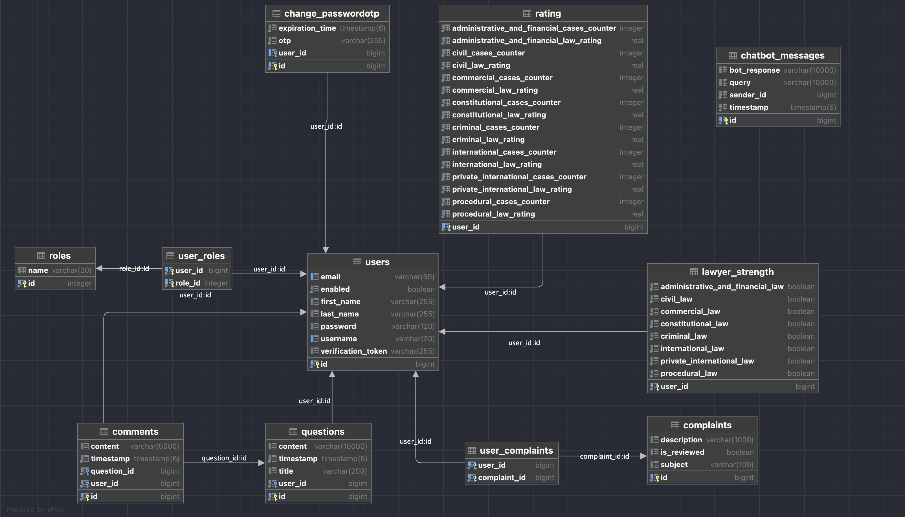

# Mashoora

### Expert Legal Advice at Your Fingertips

---
**Mashoora, meaning "advice" in Arabic**, is an administrative system designed to connect customers seeking legal
guidance with qualified lawyers.

This project aims to streamline the process of finding legal help and ensure a smooth communication channel between both
parties.



---

## Installation:

In able to run the application fully, These are the prerequisites:

1. Clone the repository

   ```bash
   git clone https://github.com/homeo26/mashoora.git
   ```

2. Navigate to the project directory.

   ```bash 
   cd mashoora
   ```

3. You must edit the `application.properties` by inserting your database configs, API keys etc.
4. Make sure to run those `SQL` commands to allow the Role Relationships to be activated as the following
   commands:
    ```sql
    INSERT INTO roles(name) VALUES('ROLE_CUSTOMER');
    INSERT INTO roles(name) VALUES('ROLE_LAWYER');
    INSERT INTO roles(name) VALUES('ROLE_ADMIN');
    ```
5. You must run the Spring boot server
6. To activate the lawyer bot **Adel**, you must install those libraries:

   ```bash
   # You might need to use 'sudo' before the commands
   # You might need to install the libraries in virtual environments like conda or venv
   pip install google-generativeai
   pip install flask flask-sqlalchemy
   ```
   > **Note**: in order to be able to `pip install google-generativeai` and `pip install flask flask-sqlalchemy` it is highly recommended to install those libraries in a virtual python enviroment.
   > 
   > Take a look on the following link:
   > **[Install packages in a virtual environment using pip and venv](https://packaging.python.org/en/latest/guides/installing-using-pip-and-virtual-environments/)**

7. Run the python Flask app by running the following command.
   ```bash
   # cd into the directory of the AdelChatbot.py file and python3 it
   python3 mashoora/src/main/python/AdelChatbot.py
   ```
8. *[Optional]* inable to enable HTTPS run the following commands:
   1. install `mkcert`
      1. on **macOS**:
      2. ```bash
         brew install mkcert
         brew install nss # If you use Firefox
         ```
   2. ```bash
      # cd into the maven project
      cd mashoora/mashoora
      ```
   3. ```bash
      # Create and Install a Local CA:
      mkcert -install
      ```
   4. ```bash
      # Generate Certificates for localhost:
      mkcert localhost
      ```
   5. ```bash
      # Convert the PEM files to a PKCS12 keystore:
      openssl pkcs12 -export -out keystore.p12 -inkey localhost-key.pem -in localhost.pem -name tomcat
      # password = mashoora-zfx1
      ```
   6. ```bash
      # Create the ssl directory under src/main/resources and move the keystore.p12 file there:
      mkdir -p src/main/resources/ssl
      mv keystore.p12 src/main/resources/ssl/
      ```
   7. ```bash
      # Clean and rebuild your project to ensure it picks up the new resources:
      ./mvnw clean package
      ./mvnw spring-boot:run
      ```